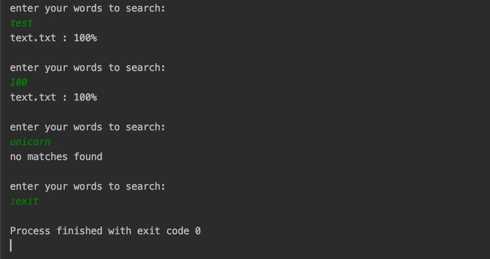
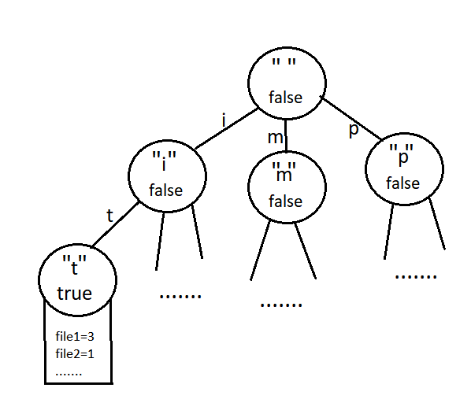

# SearchEngine
This is special tool for optimised search in folder.

### Usage:
1.Clone repository  
2.Run "sbt" command inside  
3.Run command <b>runMain test.SimpleSearch directoryContainingTextFiles</b>  
where directoryContainingTextFiles - absolute path to the directory you want to search  
4.You'll be promted to enter the list of words separated by spaces. 
For example: 
<b>>david cat</b> 
5.You'll get list of all files which contain at least 1 of the words with occurence percentage. 
<b>Note:</b> formula for percentage: 
<b>([number of words from list that file contains] / [whole number of words in list entered]) * 100</b>  
6.If you want to exit, enter <b>:exit</b> instead of the word 

repository contains also folder "testFolder" for unit tests, demos and dev tests
### Example:

Representation in memory: 
All the words are stored in modified Trie structure (https://en.wikipedia.org/wiki/Trie).  
  <b>Example structure of the trie:</b> 

Each node contains char of current letter, map of child nodes, parameter "is-finished" (means ending of the word), and if "is-finished"==true, there's also map that contains names of files and number of occurences of this word in each file  
